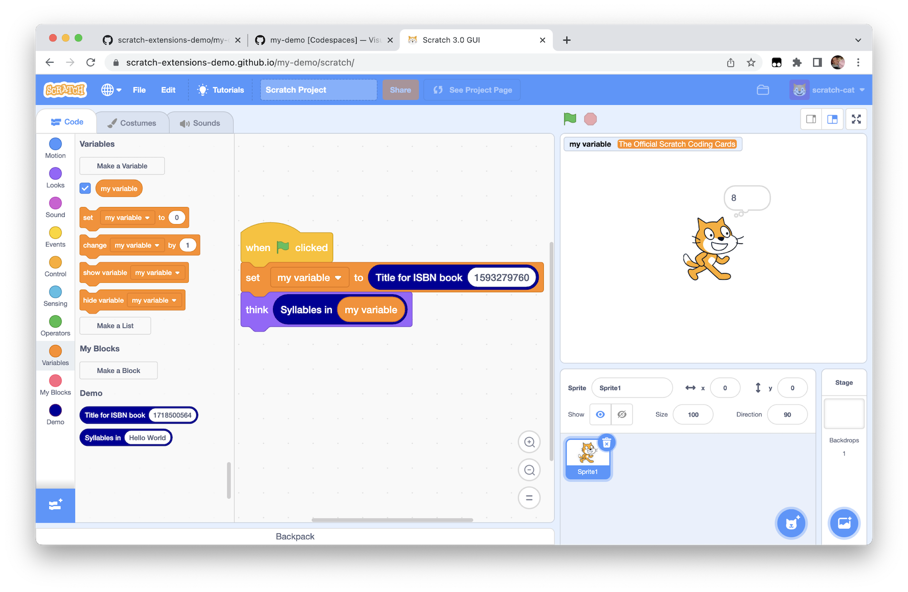

# Development environment for creating unofficial Scratch extensions

This is a repo for [my workshop](https://www.eventbrite.co.uk/e/workshop-write-your-own-scratch-extension-tickets-533502218497) at the [Raspberry Pi Clubs Conference](https://www.raspberrypi.org/clubs-conference-2023/) - about how to create your own custom blocks for Scratch.

This repo has [instructions](./INSTRUCTIONS.md), a template extension, and an online hosted development environment, so you can create your own Scratch extensions using only a web browser. No local developmnent tools or other software is needed.

I've included step-by-step instructions for building different types of Scratch extensions, including Scratch blocks based on web APIs, and Scratch blocks based on JavaScript modules from npm.

I created it for educators and coding group volunteers, who would like to customize Scratch for their students by giving them new and unique blocks to create with. In particular, I wanted to make this accessible to people who perhaps don't necessarily think of themselves as developers and wouldn't otherwise know how to clone the Scratch Team repos and start hacking it.

Go to [INSTRUCTIONS.md](./INSTRUCTIONS.md) to find a written step-by-step guide, or watch me step through the process in [this video](https://youtu.be/bX9ZqhuxtnI).

I've wrapped all the complicated bits in scripts that set everything up, and prepared an online Scratch extension development environment – so everything can be done in a web browser without having to install or configure anything on your own computer.

If you make something with this, please [let me know](https://github.com/dalelane/scratch-extension-development/issues) - I'd love to hear about it...

